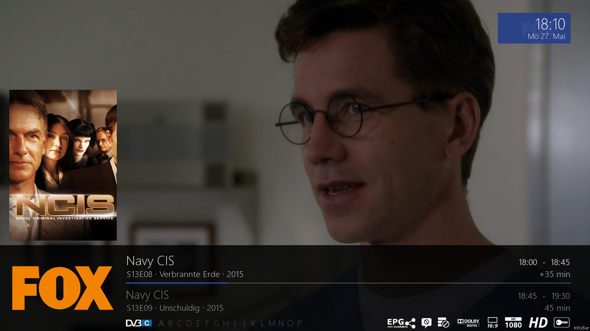

# MetrixReloaded
MetrixReloaded ist ein HD Skin für VU+ Receiver mit [VTI Image](https://www.vuplus-support.org/).

## Unterstütze Images:
* VTI v14.x

## Unterstützte Plugins
* EPGShare (im Skin optional implementiert)
* [EPGRefresh](https://wiki.vuplus-support.org/index.php?title=EPGrefresh)
* [SerienRecorder](https://github.com/einfall/serienrecorder)

## Aufbau des Repositories

## Screenshots
<body>

 </body>

  
  
  

## Changelog
### 1.1.3 (xx.xx.2019)
* bug fixes

